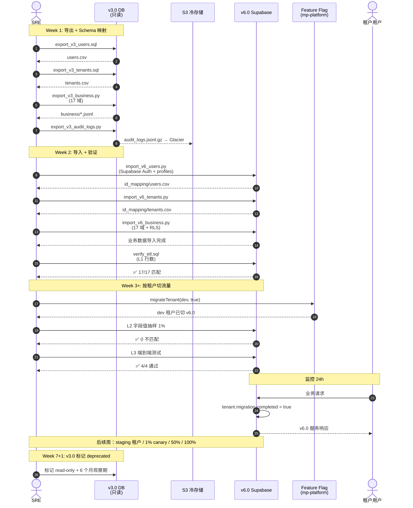

# ETL Migration Sequence（v3.0 → v6.0）

> 一次性 ETL + 按租户分批切流量

## 关键点

1. **完全抛弃 v3.0 代码**，仅 ETL 数据
2. **3 层校验**：L1 行数 + L2 字段值 + L3 端到端
3. **按租户分批**：dev → staging → 1% canary → 50% → 100%
4. **每次切流量前 24h 内重跑校验**
5. **feature flag 即时切换**（毫秒级）
6. **失败可回滚**（feature flag 关闭 + 切回 v3.0）