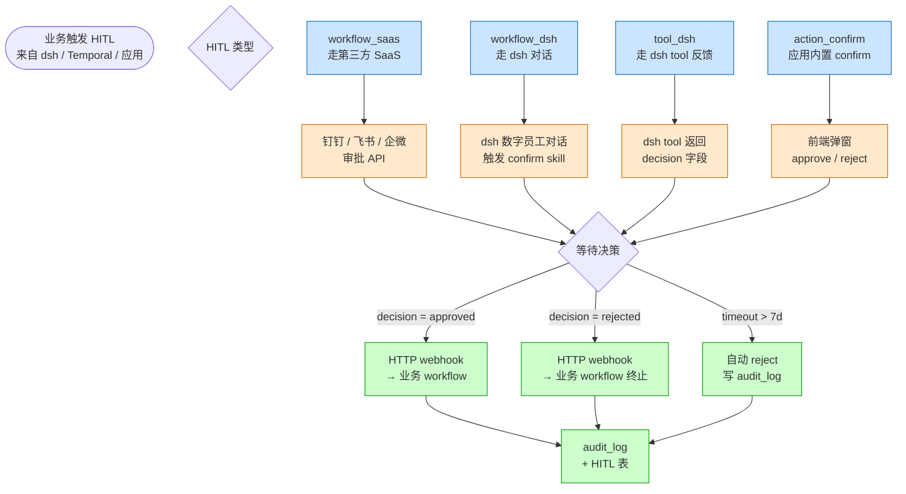

# HITL Hub 4 类决策流

> Human-in-the-Loop 4 种类型联动

## 4 类 HITL 对比

| 类型 | 适用场景 | 触发方 | 决策方 |
|---|---|---|---|
| **workflow_saas** | 财务审批 / 合同审批 | Temporal signal | 钉钉 / 飞书 / 企微审批人 |
| **workflow_dsh** | AI 决策后人工确认 | dsh workflow | 数字员工对话中 |
| **tool_dsh** | 工具调用需确认（如删除）| dsh tool | dsh 用户 |
| **action_confirm** | 普通业务确认 | 前端按钮 | 应用用户 |

## 共同特征

- **超时默认 7 天**，自动 reject
- **所有决策进 audit_log**
- **状态机**：pending → approved / rejected / timeout
- **webhook 回调**业务 workflow（毫秒级）