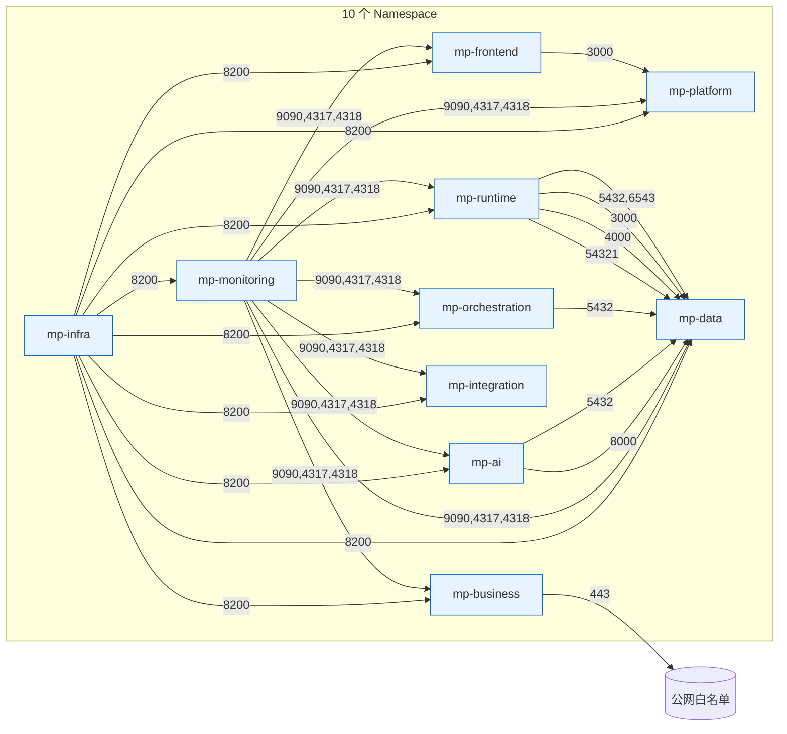

# NetworkPolicy Namespace 矩阵

> 跨 namespace 通信白名单

## Default-Deny

每个 namespace 默认：
- **Ingress**：拒绝所有（除显式 allow）
- **Egress**：拒绝所有（除显式 allow）

所有图中的边 = 显式 allow policy。

## 关键路径

| 路径 | 用途 |
|---|---|
| mp-frontend → mp-platform | 前端 API 调用 |
| mp-runtime → mp-data | 业务应用访问 Supabase |
| mp-orchestration → mp-data | Temporal 持久化 |
| mp-ai → mp-data | embedding / RAG 写入 |
| mp-monitoring → * | 抓取所有 namespace 的 metrics |
| mp-infra → * | Vault agent 同步 |