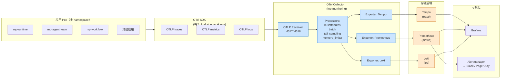

# OTel Collector 数据流

> 应用 → OTel Collector → 存储后端 → Grafana

## 关键点

1. **OTel SDK 自动注入**（通过 env 或 sidecar）
2. **OTel Collector 集中处理**：k8s attributes 注入 / 批量发送 / 采样
3. **三路输出**：trace → Tempo / metric → Prometheus / log → Loki
4. **Grafana 统一面板**（查询 3 个数据源）
5. **告警走 Alertmanager** → Slack / 钉钉 / PagerDuty

## 采样策略（生产）

| Trace 类型 | 采样率 |
|---|---|
| 错误 | 100% |
| P99 延迟 > 3s | 100% |
| 正常请求 | 10% |