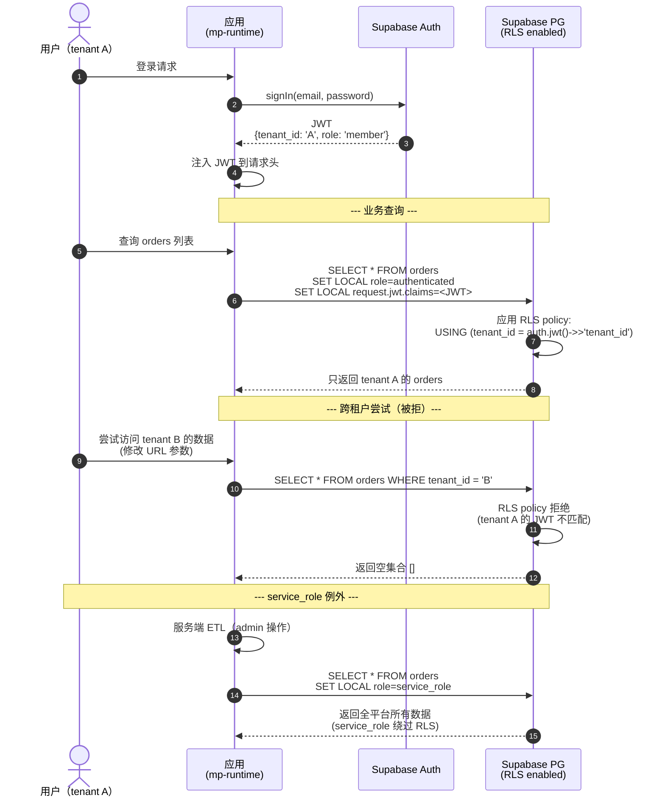

# Supabase + RLS 多租户数据流

> 多租户隔离：JWT → RLS policy → SQL 过滤

## 关键点

1. **JWT claim `tenant_id`** 是隔离的核心
2. **RLS policy** 在 SQL 层强制 tenant_id 过滤
3. **service_role** 仅服务端使用，业务代码禁用
4. 跨租户访问被 RLS 静默拒（返回空集合），不是错误