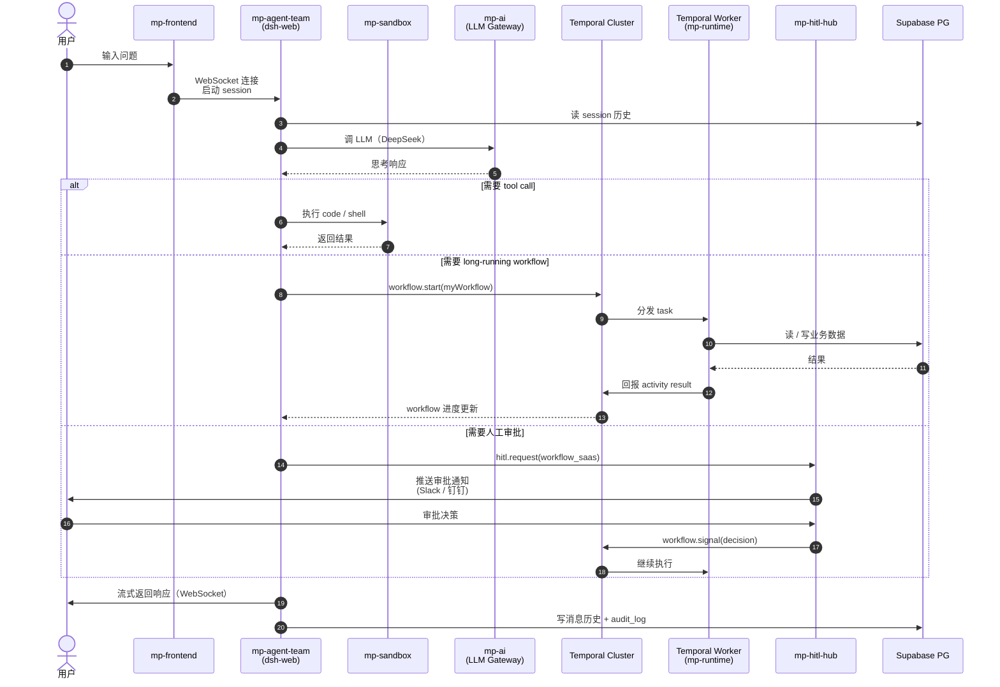

# Temporal + dsh + Supabase 数据流

> 数字员工 dsh 启动 + 通过 Temporal 执行工作流 + 访问 Supabase

## 关键路径

| 路径 | 用途 | 涉及模块 |
|---|---|---|
| **1. 短对话** | 简单问答 | AgentTeam → AI → 返回 |
| **2. Tool call** | 数字员工执行代码 | AgentTeam → Sandbox |
| **3. 长 workflow** | 1 周+ 异步任务 | AgentTeam → Temporal → Worker → Supabase |
| **4. HITL 审批** | 关键决策需人工 | AgentTeam → HITL → 外部 SaaS / dsh 通知 |

## 数据持久化

- **session 历史**：mp_agent_team.messages（PG）
- **workflow 状态**：Temporal 自带持久化（专用 PG schema）
- **业务数据**：Supabase PG 业务 schema（RLS 隔离）